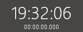

# clock
Simple clock with a stopwatch.

For those used to clicking on taskbar clock in Windows 10 to see seconds, which is missing in Windows 11 - this simple application is a replacement.\
\
ESC - close\
F1 - help\
F2 - toggle topmost\
F3 - stopwatch\
Left doubleclick - close\
Control + left click - toggle topmost\
Right click - stopwatch
